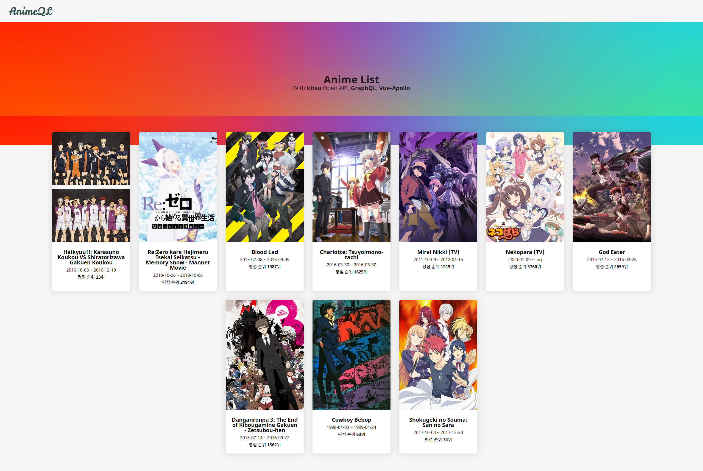
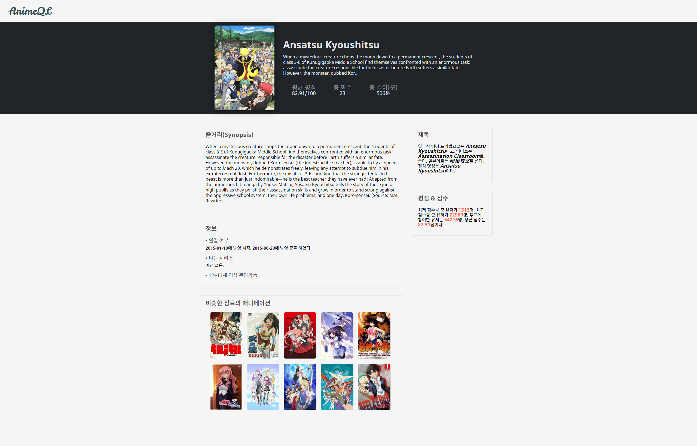

# AnimeQL-Client

This service is a full stack service using GraphQL Apollo Client, Kitsu Open API and Vue.

- [Kitsu Open API](https://kitsu.docs.apiary.io/)
- [Vue-Apollo Client](https://vue-apollo.netlify.com/)
- [GraphQL-Yoga](https://github.com/prisma-labs/graphql-yoga)
- [Vue 2.6.11](https://vuejs.org/)

Separated the front-end and back-end repositories. this repository is front-end. here [Back-End Repository (With GraphQL Yoga)](https://github.com/n2ptune/animeql-server)

## Development

Developing this service requires a server and a client.

Download the repository from the two repositories using the `git clone` command.

- [https://github.com/n2ptune/animeql-client](https://github.com/n2ptune/animeql-client)
- [https://github.com/n2ptune/animeql-server](https://github.com/n2ptune/animeql-server)

Server has one command to start server that 4000 port on nodemon by default `yarn dev`

## Demo

There are two pictures for the detail page and the home page.

See the page for [details.](https://anime.unending.xyz/)
